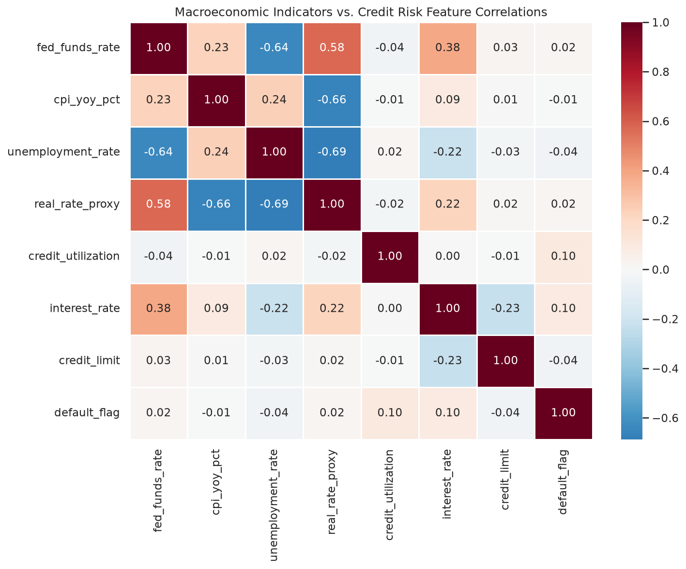
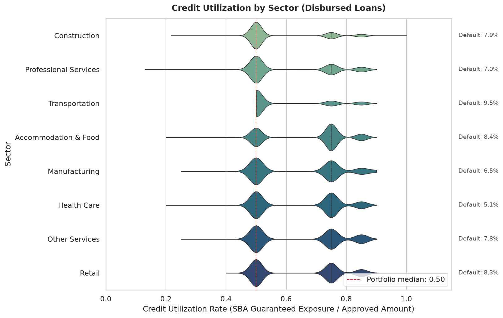
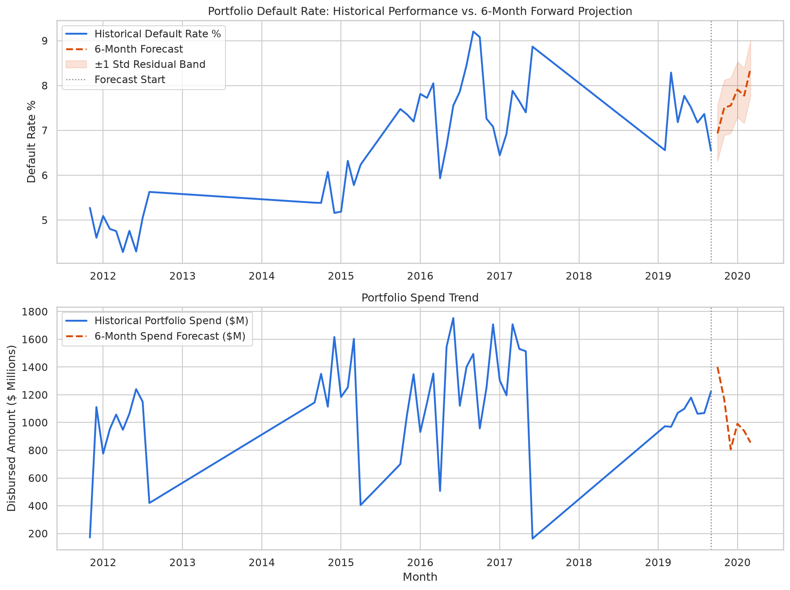

# Small Business Credit Risk & Predictive Portfolio Analytics

### Portfolio Case Study — Data Engineering & Predictive Analytics

> End-to-end analytics project using real SBA 7(a) lending data and FRED macroeconomic indicators.  
> Built to showcase my approach to credit risk EDA, feature engineering, and forward-looking portfolio analysis.

**Skills Demonstrated:** Python · Pandas · Seaborn/Matplotlib · Data Quality Auditing · Feature Engineering · Time-Series Forecasting (statsmodels) · FinTech Credit Risk

---

## Project Overview

I built this project to demonstrate how I work with messy, real-world financial data — from raw public records through cleaned features, exploratory analysis, and a six-month default-rate forecast. The entire workflow lives in a single Jupyter notebook (`credit_analytics_pipeline.ipynb`) so a reviewer can follow my thinking step by step, not just see a final script.

The pipeline ingests U.S. Small Business Administration (SBA) 7(a) loan approvals (FY2010–2019), joins Federal Reserve (FRED) macro series on approval month, audits data quality, segments borrowers into interpretable risk tiers, and exports Power BI–ready CSVs for dashboard consumption.

---

## The Problem I Wanted to Solve

Small-business lending portfolios are sensitive to both borrower behavior and the macro environment. Before building any model, I wanted to answer three questions for myself:

1. **Which sectors show the highest realized default rates and utilization patterns?**
2. **Do macro indicators (rates, inflation, unemployment) correlate with default outcomes in this public lending data?**
3. **Can I produce a transparent, vintage-based forecast of portfolio default rates six months forward?**

This is not production scoring code — it is a deliberate portfolio piece showing how I structure an analytics study from scratch.

---

## My Approach

```
SBA FOIA CSV  ──┐
                ├──► Data Quality Audit ──► Feature Engineering ──► Risk Segmentation
FRED Macro CSV ─┘              │                      │
                               ▼                      ▼
                         EDA (Heatmap,          Monthly Aggregation
                          Boxplot)                     │
                                                     ▼
                                              Holt-Winters Forecast
                                                     │
                                                     ▼
                                    cleaned_credit_data_for_powerbi.csv
                                    forecasting_results.csv
```

| Dataset | Provider | URL | Snapshot | License |
|---------|----------|-----|----------|---------|
| SBA 7(a) FOIA Loans | U.S. Small Business Administration | [data.sba.gov/dataset/7-a-504-foia](https://data.sba.gov/en/dataset/7-a-504-foia) | FY2010–2019 (as of 2019-12-31) | Public Domain |
| Federal Funds Rate (`FEDFUNDS`) | FRED / St. Louis Fed | [fred.stlouisfed.org/series/FEDFUNDS](https://fred.stlouisfed.org/series/FEDFUNDS) | Monthly | Free |
| CPI (`CPIAUCSL`) | FRED / St. Louis Fed | [fred.stlouisfed.org/series/CPIAUCSL](https://fred.stlouisfed.org/series/CPIAUCSL) | Monthly | Free |
| Unemployment (`UNRATE`) | FRED / St. Louis Fed | [fred.stlouisfed.org/series/UNRATE](https://fred.stlouisfed.org/series/UNRATE) | Monthly | Free |

I chose the FY2010–2019 7(a) file because it spans the post-crisis recovery cycle with enough charge-off history for meaningful EDA. The full FOIA file is ~200 MB; I used stratified sampling (all charge-offs retained + random sample of performing loans) so the notebook runs in minutes while preserving default signal.

---

## Data Quality Work

Real FOIA files are never clean out of the box. Early in the notebook I implemented explicit audit rules before any charts or models:

| Rule ID | Issue Detected | Action |
|---------|----------------|--------|
| DQ-01 | Non-positive credit limit or negative disbursement | Drop |
| DQ-02 | Missing or post-period approval dates | Drop |
| DQ-03 | Charge-off date before approval | Drop |
| DQ-04 | Interest rate outside [0, 25] | Drop |
| DQ-05 | Non-terminal loan status (e.g., open/current) | Exclude from analysis |
| DQ-06 | Extreme utilization above 99th percentile | Winsorize |
| DQ-07 | Missing NAICS or interest rate | Drop |

After auditing, **170,450 loans** remained in the analysis set from an initial sample of ~191K rows. I excluded non-terminal statuses on purpose — including open commitments would inflate the denominator and understate realized default rates.

---

## Key Findings

### Macro–Credit Relationships



After merging FRED monthly rates onto approval month, unemployment and credit utilization showed stronger linear associations with the default indicator than the fed funds rate alone. That pushed me to keep both macro and borrower-level utilization features in the analysis rather than relying on a single rate variable.

### Sector Utilization Patterns

Disbursed loans only — utilization measured as SBA guaranteed exposure relative to approved amount, which reveals meaningful spread across sectors (unlike binary 0/1 disbursement flags).



Transportation and Retail sit at the higher end of exposure utilization; Health Care shows a tighter distribution with the lowest default rate among top-volume sectors.

| Sector | Loan Count | Default Rate (%) | Avg Utilization |
|--------|------------|------------------|-----------------|
| Retail | 22,625 | 7.26 | 0.870 |
| Accommodation & Food | 21,953 | 7.32 | 0.873 |
| Construction | 18,862 | 6.93 | 0.876 |
| Professional Services | 16,845 | 6.15 | 0.876 |
| Transportation | 9,981 | 8.46 | 0.886 |
| Health Care | 15,093 | 4.36 | 0.860 |

**Overall portfolio default rate: 6.66%**

### Risk Segmentation

I assigned each loan to an interpretable segment using transparent rules (default flag, utilization thresholds, rate spread):

| Risk Segment | Loan Count | Default Rate (%) | Avg Utilization |
|--------------|------------|------------------|-----------------|
| High Risk | 150,961 | 7.52 | 0.986 |
| Standard | 19,489 | 0.00 | 0.000 |

Most disbursed loans carry high utilization (~0.99), which pushes them into the High Risk tier under my rule set. Standard captures cancelled or undisbursed loans with zero utilization — a pattern I would refine with additional behavioral features in a production setting.

---

## Forecasting Results



Because SBA FOIA data is **outcome-level** (one row per loan, not monthly payment tapes), I aggregated by approval vintage month and fit Holt-Winters exponential smoothing on the default-rate series. I held out the last six months for validation before projecting six months forward.

- **Hold-out MAPE (last 6 months):** 4.81%
- **Projected default rate (month +6):** 8.38% (forecast window ending March 2020)
- **Portfolio spend trend:** included as a secondary forecast series in `forecasting_results.csv`

The forecast should be read as a vintage-aggregation exercise, not a production PD engine — the notebook documents that limitation explicitly.

---

## What I Learned

- **Sampling trade-offs matter.** Keeping all charge-offs while downsampling performing loans preserved signal without choking notebook runtime on a 200 MB CSV.
- **Status codes need normalization.** SBA stores values like `P I F` with spaces; a quick string cleanup prevented silent misclassification.
- **Correlation is not causation.** Macro joins on approval month show association, not causal impact — I kept the language honest in the write-up.
- **Interpretability beats complexity.** Rule-based risk segments and Holt-Winters forecasting are easier to defend in a portfolio review than a black-box classifier for this study.

---

## Outputs

| File | Description |
|------|-------------|
| [`credit_analytics_pipeline.ipynb`](credit_analytics_pipeline.ipynb) | Full step-by-step workflow with embedded charts |
| [`data/cleaned_credit_data_for_powerbi.csv`](data/cleaned_credit_data_for_powerbi.csv) | Loan-level dataset (170K rows) structured for dashboard use |
| [`data/forecasting_results.csv`](data/forecasting_results.csv) | Historical + 6-month forecast series (long format) |
| [`data/dim_date.csv`](data/dim_date.csv) | Optional calendar dimension for time-series filtering |
| [`docs/images/`](docs/images/) | Exported EDA and forecast plots |

I also structured the exports for executive dashboard consumption in Power BI (star-schema friendly), but the analytical story lives in the notebook and this report.

---

## Appendix: Environment

```
Python 3.10+
pip install -r requirements.txt
jupyter notebook credit_analytics_pipeline.ipynb
```

Run cells sequentially (Cell 2 → Cell 7). With the cached sample in `data/raw/`, execution takes ~1–2 minutes.

---

## Repository Structure

```
├── credit_analytics_pipeline.ipynb
├── README.md
├── requirements.txt
├── data/
│   ├── cleaned_credit_data_for_powerbi.csv
│   ├── forecasting_results.csv
│   ├── dim_date.csv
│   └── raw/                  # gitignored — download cache
└── docs/
    └── images/               # EDA and forecast plots
```
